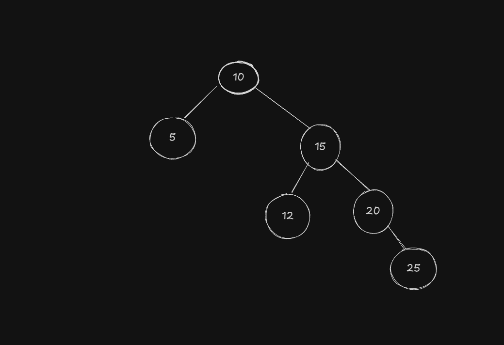
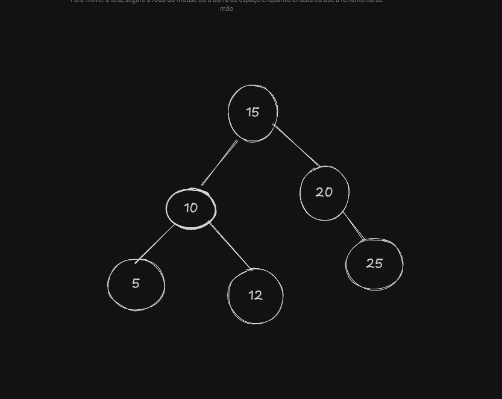
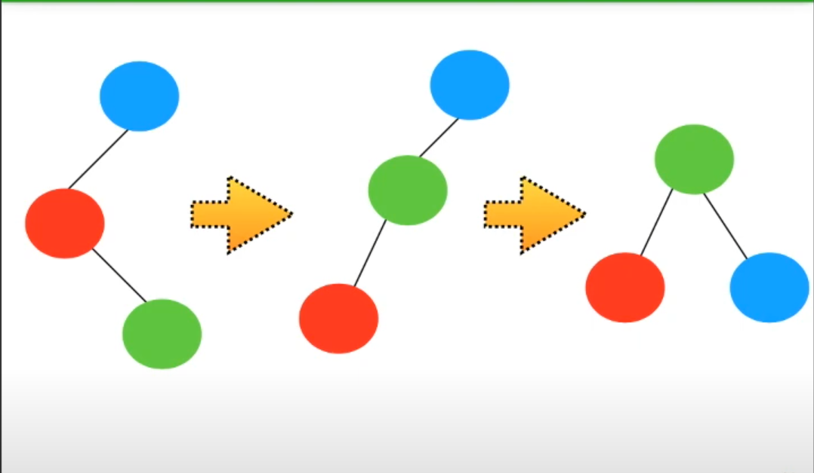

# Árvores Binárias AVL

São árvores binárias que possuem uma característica especial, que é seu balanceamento automático. As árvores binárias balanceadas trazem uma alta eficiência em buscas que possibilitam buscar um valor no pior caso num tempo Olog2(n). Porém, para isso é necessário garantir o balanceamento da árvore. Foi a partir disso que surgiram as árvores AVL.

As árvores AVL possuem os seguintes níveis balanceamento:
- -1 Desbalanceamento Para a esquerda
- +1 Desbalanceamento Para a direita
- 0 Para a árvore balanceada

### Inserção e Remoção de Elementos

A cada inserção ou remoção de elementos, deve-se verificar se tal ação irá gerar um desbalanceamento na árvore. Se isso acontecer, há operações simétricas que devem ser aplicadas para corrigir o balanceamento da árvore. São elas:
1. Rotação Simples à esquerda / Rotação Simples à direita
2. Rotação Dupla à esquerda / Rotação Dupla à direita

#### Rotação Simples
- Inserir um novo nó à direita da sub-árvore direita ou
- Inserir um novo nó à esquerda da sub-árvore esquerda

Com essa rotação, se o nó da direita que irá se transformar em raíz tiver filhos a esquerda, é garantido que esse filho poderá se trans formar em um filho do nó que será balanceado. (Mesmo caso acontece para a esquerda)

#### Rotação Dupla
- Inserir um novo nó à direita da sub-árvore direita ou
- Inserir um novo nó à esquerda da sub-árvore esquerda

#### Como verificar a rotação que será aplicada?
Para isso, é necessário verificar os sinais do nó que está desbalanceado e do filho dele que está causando o desbalanceamento.
- Se eles tiverem o mesmo sinal: Rotação Simples (Bal pai +2 e Bal filho +1)
- Se eles possuirem sinais diferentes: Rotação Dupla (Bal pai -2 e Bal filho +1)

