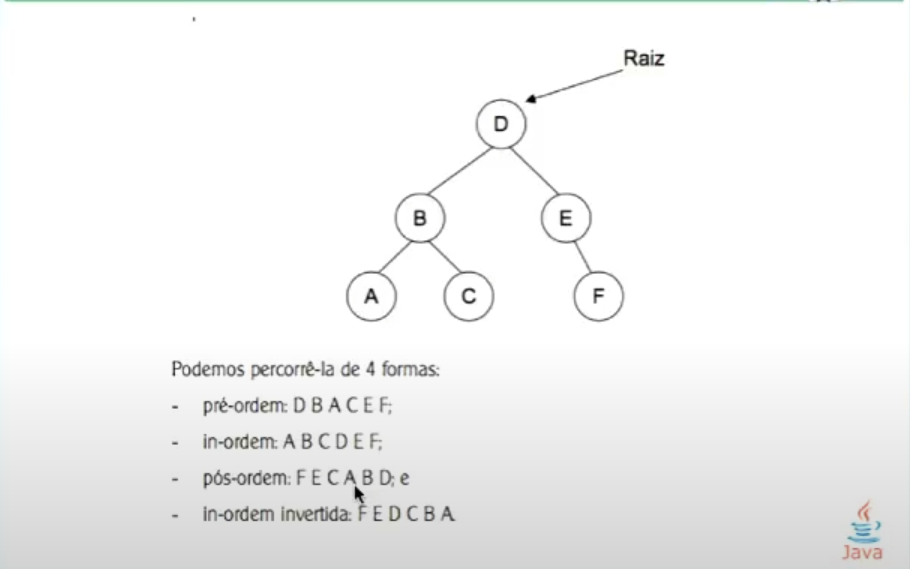
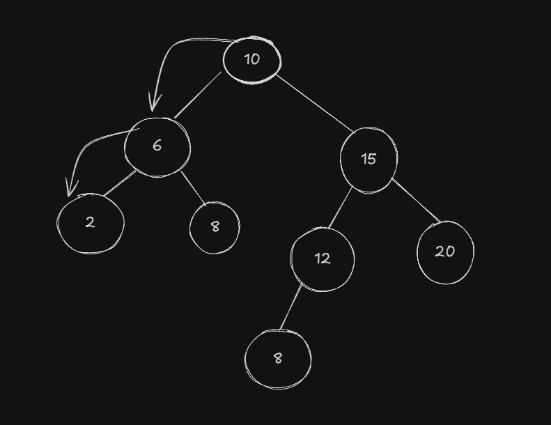

# Árvores Binárias

São estruturas recursivas que iniciam-se por um nó raiz que são distribuídas em nós descendentes que também são árvores. Esses nós guardam informações e têm obrigatoriamente no máximo dois filhos. Curiosidade: As árvores são linked lists aprimoradas.

- Nós filhos sem descendentes são nós folha
- O que torna a árvore eficiente para busca é o critério de inserção
- Todos os elementos à direita da raiz são maiores
- Todos os elementos à esquerda da raiz são menores
- Os dados que são guardados na árvore são índices únicos que identificam informações. Isso significa que não é viável inserir dados duplicados, pois com isso, a árvore binária perderia o seu propósito.


## Funcionamento

Tudo nas árvores binárias funciona de forma recursiva passando as responsabilidades para as sub-árvores. As árvores são eficientes somente se estiverem balanceadas. Se isso não acontecer, a árvore perde seu fundamento e funciona como uma busca sequencial.

### Busca

### Percurso




Existem quatro maneiras de se percorrer uma árvore binária:
- Pré-ordem: Percorre a raíz, depois todos os elementos da esquerda e por último, todos os elementos da direita
- In-ordem: Percorre a árvore em sentido horário, passando pelos elementos da esquerda, depois a raíz e por último os elementos da direita
- Pós-ordem: Percorre todos os elementos da direita, depois da esquerda e por último a raíz
- In-ordem invertida: testing...


### Remoção de Elementos
Existem 4 que devem ser analisados ao excluir um elemento de uma árvore. São eles:
1. Se o nó a ser excluído é um **nó folha**
2. Se o nó a ser excluído tem filhos à esquerda
3. Se o nó a ser excluído tem filhos à direita
4. Se o nó a ser excluído tem filhos dos dois lados (Esse é o caso mais complexo. Para fechar este caso, é preciso adotar uma estratégia de troca: Trocar o elemento a ser excluído com o maior dentre os menores ou trocar com o menor dentre os maiores).

Ao trabalhar com árvores, tudo não passa de delegação de responsabilidades (Linked List).

Exemplo de código do método **remove**:

```js
    public remove(element: Element) {
        if (this.value!.getValue() === element.getValue()) {
            // Caso 1 - Nó folha
            if (this.left == null && this.right == null)
                return null;

            // Caso 2 - Nó com filhos à esquerda
            if (this.left && this.right == null)
                return this.left;

            // Caso 3 - Nó com filhos à direita
            if (this.right && this.left == null)
                return this.right;


            // Caso 4 -  Nó com filhos dos dois lados
            let auxNode = this.left;

            while (auxNode?.right != null) {
                auxNode = auxNode.right;
            }

            this.value = auxNode!.getValue();
            auxNode?.setValue(element);
            this.left = this.left!.remove(element);
        } else {
            
            if (element.getValue() < this.value!.getValue())
                this.left = this.left!.remove(element);

            else if (element.getValue() > this.value!.getValue())
                this.right = this.right!.remove(element);

        }
        return this;
    }
```



